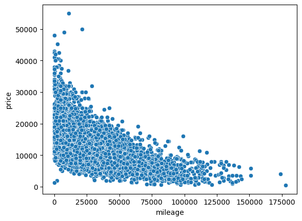
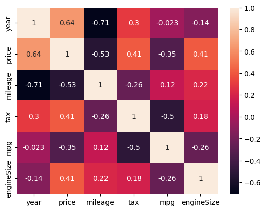

# 🚗 Ford Car Price Prediction (Machine Learning Project)

## 📌 Overview
This project focuses on predicting the price of used Ford cars using machine learning techniques. The goal is to build a reliable regression model that can estimate car prices based on various features such as model, year, transmission, fuel type, and mileage.

---

## 🎯 Problem Statement
Used car pricing is often inconsistent and depends on multiple factors. This project aims to:
- Identify key features influencing car prices
- Build a predictive model
- Evaluate model performance using standard regression metrics

---

## 📂 Dataset
- Dataset contains information about Ford cars including:
  - Model
  - Year
  - Transmission
  - Fuel Type
  - Mileage
  - Engine Size
  - Price (Target Variable)

---

## 🔄 Project Workflow

The project follows a structured machine learning pipeline:

1. **Data Collection**
   - Imported dataset containing Ford car features and prices

2. **Data Understanding**
   - Explored dataset structure, data types, and summary statistics
   - Identified key variables and potential issues

3. **Data Preprocessing**
   - Handled missing values
   - Encoded categorical variables using one-hot encoding
   - Removed irrelevant or redundant features

4. **Exploratory Data Analysis (EDA)**
   - Analyzed relationships between features and target variable
   - Visualized key patterns (price distribution, mileage impact, etc.)

5. **Feature Engineering**
   - Selected important features influencing price
   - Prepared final dataset for modeling

6. **Train-Test Split**
   - Split data into training and testing sets (80-20)

7. **Model Building**
     - Linear Regression     

8. **Model Evaluation**
   - Evaluated models using MAE, RMSE, and R² score
   - Compared performance to select the best model

9. **Model Interpretation**
   - Analyzed feature importance
   - Studied prediction errors using residual analysis

10. **Visualization & Reporting**
   - Created plots to explain insights and model performance
   - Documented findings in README

---

## ⚙️ Technologies Used
- Python
- Pandas
- NumPy
- Matplotlib / Seaborn
- Scikit-learn

---

## 🔍 Data Preprocessing
- Handled missing values
- One-hot encoding for categorical variables
- Feature selection
- Train-test split (80-20)

---

## 🤖 Models Used
- Linear Regression

---

## 📊 Model Evaluation
Performance was evaluated using:

- Mean Absolute Error (MAE): 1371.19
- Mean Squared Error (MSE): 3442092.84
- Root Mean Squared Error (RMSE): 1855.28
- R² Score: 0.846
- Adjusted R²: 0.844

---

### 📊 Price Distribution

The distribution of car prices is right-skewed, indicating that most vehicles fall within a lower to mid-price range, with a few high-priced outliers. This suggests the presence of premium models and highlights the need for models that can handle skewed data.

### 📅 Price vs Year

There is a strong positive relationship between the car's manufacturing year and its price. Newer vehicles tend to have significantly higher prices, making "year" one of the most influential features in predicting car value.

### 🚗 Mileage vs Price

Mileage shows a clear negative correlation with price, where higher mileage leads to lower car value. This reflects real-world depreciation and confirms mileage as a critical predictor in the model.

### 🔥 Correlation Heatmap

The heatmap highlights relationships between numerical features. Strong correlations are observed between price and variables like year and mileage, helping in feature selection and reducing redundant variables for better model performance.

---

## 📊 Results

The machine learning models were evaluated using MAE, RMSE, and R² metrics emerged as the best-performing model. It achieved an R² score of 0.846, indicating strong explanatory power, and an RMSE of 1855.28, showing that predictions are reasonably close to actual prices. Key features influencing the predictions include **year, mileage, and model type**, which had the most significant impact on car pricing.

---

## 🏁 Conclusion

This project demonstrates the practical application of machine learning in solving a real-world pricing problem. By following a structured pipeline—including data preprocessing, exploratory data analysis, feature engineering, and model evaluation—a reliable regression model was developed.

Overall, this project highlights the importance of combining domain knowledge with machine learning to build practical and scalable solutions.

