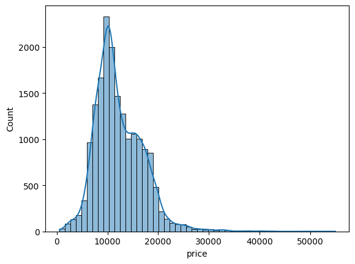
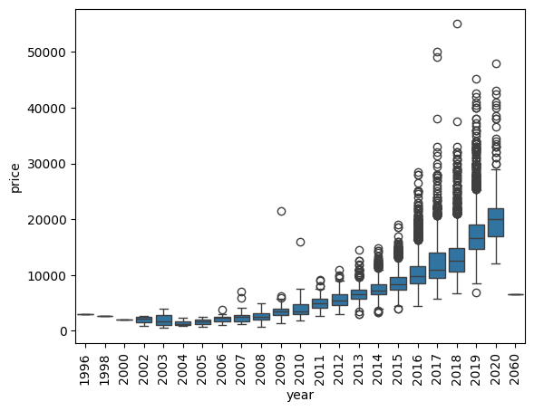

# 🚗 Ford Car Price Prediction (Machine Learning Project)

## 📌 Overview
This project focuses on predicting the price of used Ford cars using machine learning techniques. The goal is to build a reliable regression model that can estimate car prices based on various features such as model, year, transmission, fuel type, and mileage.

---

## 🎯 Problem Statement
Used car pricing is often inconsistent and depends on multiple factors. This project aims to:
- Identify key features influencing car prices
- Build a predictive model
- Evaluate model performance using standard regression metrics

---

## 📂 Dataset
- Dataset contains information about Ford cars including:
  - Model
  - Year
  - Transmission
  - Fuel Type
  - Mileage
  - Engine Size
  - Price (Target Variable)

---

## ⚙️ Technologies Used
- Python
- Pandas
- NumPy
- Matplotlib / Seaborn
- Scikit-learn

---

## 🔍 Data Preprocessing
- Handled missing values
- One-hot encoding for categorical variables
- Feature selection
- Train-test split (80-20)

---

## 🤖 Models Used
- Linear Regression

---

## 📊 Model Evaluation
Performance was evaluated using:

- Mean Absolute Error (MAE): 1371.19
- Mean Squared Error (MSE): 3442092.84
- Root Mean Squared Error (RMSE): 1855.28
- R² Score: 0.846
- Adjusted R²: 0.844

---

### 📊 Price Distribution

The distribution of car prices is right-skewed, indicating that most vehicles fall within a lower to mid-price range, with a few high-priced outliers. This suggests the presence of premium models and highlights the need for models that can handle skewed data.

### 📅 Price vs Year

There is a strong positive relationship between the car's manufacturing year and its price. Newer vehicles tend to have significantly higher prices, making "year" one of the most influential features in predicting car value.

### 🚗 Mileage vs Price

Mileage shows a clear negative correlation with price, where higher mileage leads to lower car value. This reflects real-world depreciation and confirms mileage as a critical predictor in the model.

### 🔥 Correlation Heatmap

The heatmap highlights relationships between numerical features. Strong correlations are observed between price and variables like year and mileage, helping in feature selection and reducing redundant variables for better model performance.

